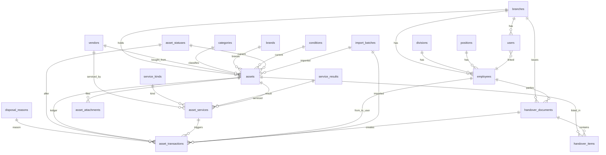

# 02 — Model Data

Nama tabel/kolom bahasa Inggris (konvensi Laravel); label UI bahasa Indonesia lewat `lang/id`.

## 1. Diagram relasi

## 2. Master data

| Tabel | Kolom |
|---|---|
| `branches` | `id`, `code` (3 huruf, unik), `name`, `address`, `phone`, `is_active` |
| `divisions` | `id`, `name` (unik), `is_active` |
| `positions` | `id`, `name` (unik), `is_active` |
| `vendors` | `id`, `name` (unik), `type` enum(`toko`,`servis`,`keduanya`), `contact`, `phone`, `address`, `notes`, `is_active` |
| `disposal_reasons` | `id`, `code` (unik), `name`, `is_lost` (bool), `is_system`, `is_active`, `sort_order` |
| `service_kinds` | `id`, `code`, `name`, `changes_spec` (bool), `is_system`, `is_active`, `sort_order` |
| `service_results` | `id`, `code`, `name`, `applies_spec` (bool), `marks_broken` (bool), `is_system`, `is_active`, `sort_order` |
| `attachment_types` | `id`, `code`, `name`, `is_system`, `is_active` |
| `employees` | `id`, `name`, `nik` (nullable, unik bila terisi), `position_id` (FK `positions`), `division_id`, `branch_id`, `is_active`, `can_sign_as_witness`. Nama **tidak** unik; dropdown menampilkan `nama — divisi (cabang)` |
| `categories` | `id`, `name`, `code_prefix` (2–3 huruf, unik, wajib), `requires_serial`, `last_seq`, `is_active`, `sort_order` |
| `brands` | `id`, `name` (unik), `is_active` |
| `conditions` | `id`, `code` (unik; sistem: `baik`, `hilang`), `name`, `applies_to` enum(`hardware`,`license`,`all`), `is_system`, `is_active`, `sort_order` |
| `asset_statuses` | `id`, `code` (unik), `name`, `stock_direction` enum(`out`,`in`,`neutral`,`writeoff`), `transferable`, `requires_qty`, `clears_holder`, `is_system`, `is_active`, `sort_order` |

### Seed `asset_statuses`

| code | name | stock_direction | transferable | requires_qty | clears_holder | Dipakai untuk |
|---|---|---|---|---|---|---|
| `in_use` | Dipakai | out | ya | ya | tidak | barang diserahkan; stok berkurang |
| `spare` | Spare / Gudang | in | ya | ya | ya | barang kembali ke gudang; stok bertambah |
| `service` | Servis | neutral | tidak | tidak | tidak | ubah status; pemegang tetap |
| `broken` | Rusak | neutral | tidak | tidak | tidak | idem |
| `disposed` | Dilepas / Dijual | writeoff | tidak | ya | ya | unit keluar permanen; hanya unit di gudang |
| `registered` | Baru Didaftarkan | neutral | ya | tidak | tidak | menandai posisi di gudang |
| `in_transit` | Dalam Perjalanan | neutral | tidak | tidak | ya | pindah cabang, menunggu konfirmasi |

### Seed `categories`
Laptop/LAP, Smartphone/SMP, Tablet/TAB, Desktop PC/PC, Monitor/MON, Printer/PRN, Lisensi/LSS (`requires_serial = true`); Aksesoris/ACC, Kabel & Charger/CBL, Tas & Casing/BAG (`false`). Master lainnya: [06-data-awal.md](06-data-awal.md). Seed alasan dilepas, jenis & hasil servis, jenis lampiran, kondisi sistem, dan aturan kelola semua master: [11-master-data.md](11-master-data.md).

## 3. `assets`

| Kolom | Tipe | Catatan |
|---|---|---|
| `id` | bigint PK | |
| `asset_code` | varchar(20) unik | `IDS-{prefix}-{000}`; dibuat sekali, immutable |
| `category_id` | FK | wajib; menentukan wajib serial & kondisi yang relevan |
| `brand_id` | FK | |
| `model` | varchar | |
| `quantity` | int ≥ 1 | barang berseri = 1; massal = jumlah unit |
| `serial_number` | varchar nullable | unique index biasa; MySQL/MariaDB mengizinkan banyak NULL, jadi **string kosong harus disimpan sebagai NULL** (mutator di Model) |
| `imei_1`, `imei_2` | varchar nullable | |
| `specifications` | JSON array | tiap elemen = satu bullet di surat |
| `accessories` | JSON array | tampil di Keterangan surat |
| `condition_id` | FK | kondisi saat ini; diperbarui bila transaksi mengisi `condition_after_id` |
| `purchase_date` | date nullable | ≤ hari ini |
| `vendor_id` | FK vendors nullable | master vendor (alur 15) |
| `invoice_number` | varchar | |
| `unit_price` | decimal(15,2) | |
| `warranty_until` | date nullable | ≥ `purchase_date` |
| `branch_id` | FK | hanya berubah lewat pindah cabang |
| `split_from_asset_id` | FK assets nullable | hasil pemisahan barang massal |
| `notes` | text | |
| `current_holder_id` | FK employees nullable | cache: penanggung jawab saat ini |
| `current_user_id` | FK employees nullable | cache: pemakai saat ini |
| `current_status_id` | FK asset_statuses nullable | cache; null = "Belum diserahkan" |
| `qty_out`, `qty_in`, `qty_writeoff`, `qty_available` | int | cache; hanya ditulis `StockCalculator` |
| `import_batch_id` | FK nullable | |
| `created_by`, `updated_by`, timestamps | | **tidak ada soft delete**: aset tanpa transaksi/draft/lampiran boleh dihapus permanen (jejak tetap di activity_log); soft delete akan menahan nomor seri di unique index |

Turunan (tidak disimpan): umur, total nilai (`quantity × unit_price`), status garansi (Aktif / Hampir habis ≤ 90 hari / Habis), label pilihan `{kode} | {merk} {model} | {serial}`.

## 4. `asset_transactions` (ledger)

| Kolom | Tipe | Catatan |
|---|---|---|
| `id` | bigint PK | urutan absolut (tie-break) |
| `asset_id` | FK | |
| `type` | enum(`handover`,`return`,`status_change`,`disposal`,`branch_transfer`,`cancellation`,`correction`,`legacy`) | jenis kejadian |
| `transaction_date` | date | |
| `quantity` | int nullable | wajib > 0 bila status `requires_qty`; negatif hanya untuk `type = correction` arah `writeoff` |
| `from_employee_id` | FK nullable | wajib untuk arah `in` |
| `to_employee_id` | FK nullable | penanggung jawab; wajib untuk arah `out` |
| `user_employee_id` | FK nullable | pemakai sebenarnya |
| `status_id` | FK asset_statuses | status setelah kejadian |
| `stock_direction` | enum (snapshot) | disalin dari status saat dibuat |
| `handover_document_id` | FK nullable | wajib untuk arah `out` bertipe `handover`; boleh null untuk `legacy`, `correction`, `branch_transfer` |
| `from_branch_id`, `to_branch_id` | FK | pindah cabang |
| `condition_after_id` | FK conditions nullable | kondisi saat kejadian; memperbarui `assets.condition_id` |
| `disposal_reason_id` | FK disposal_reasons nullable | untuk `type = disposal` |
| `service_id` | FK asset_services nullable | tautan ke catatan servis yang memicu transaksi ini |
| `notes` | text | satu-satunya kolom yang boleh diedit |
| `import_batch_id` | FK nullable | |
| `legacy` | bool | data awal |
| `created_by`, timestamps | | |

## 5. Surat serah terima

| Tabel | Kolom |
|---|---|
| `handover_documents` | `id`, `document_number` (unik, null saat draft), `document_date`, `branch_id`, `first_party_id`, `second_party_id`, `witness_id` (nullable), `status` enum(`draft`,`issued`,`cancelled`), `pdf_path`, `cancelled_pdf_path`, `issued_at`, `cancelled_at`, `cancel_reason`, `legacy`, `created_by`; snapshot saat terbit: `first_party_name/position/division`, `second_party_…`, `witness_…` |
| `handover_items` | `id`, `handover_document_id`, `asset_id`, `quantity`, `user_employee_id` (nullable); snapshot `item_name`, `serial_number`, `specifications`, `condition`, `remarks`; unique (`handover_document_id`,`asset_id`) |

Snapshot dibutuhkan agar surat yang sudah terbit tidak berubah ketika data aset atau jabatan orang diedit kemudian.

## 6. Tabel pendukung

| Tabel | Kolom |
|---|---|
| `users` | `id`, `name`, `email` (unik), `password`, `role` enum(`admin_pusat`,`admin_cabang`,`viewer`), `branch_id` (nullable untuk admin pusat), `employee_id` (nullable; satu karyawan maks. satu akun), `is_active`, timestamps |
| `document_counters` | `branch_id`, `year`, `month`, `last_no`; unique (`branch_id`,`year`,`month`) |
| `import_batches` | `id`, `type`, `file_name`, `user_id`, `branch_id`, `total`, `created`, `updated`, `failed`, `log_path`, `status` enum(`preview`,`processing`,`done`,`failed`,`reverted`), timestamps |
| `asset_attachments` | `id`, `asset_id`, `service_id` (nullable), `attachment_type_id` FK, `path` (UUID di disk privat), `original_name`, `mime`, `size`, `uploaded_by`, timestamps |
| `asset_services` | `id`, `asset_id`, `service_kind_id` FK, `performed_by` enum(`internal`,`vendor`), `vendor_id` FK nullable, `item_left` (bool), `started_at`, `expected_at`, `finished_at`, `ticket_ref`, `complaint`, `work_done`, `service_result_id` FK nullable, `cost_service`, `cost_parts` decimal(15,2), `service_warranty_until` date nullable, `spec_before` JSON, `spec_after` JSON nullable, `condition_after_id` FK nullable, `status` enum(`open`,`closed`), `opened_by`, `closed_by`, timestamps. Lampiran memakai `asset_attachments` dengan `service_id` nullable | Catatan servis/perbaikan/upgrade ([alur/14](alur/14-servis-upgrade.md)); indeks `(asset_id, status)` |
| `activity_log` | bawaan `spatie/laravel-activitylog` |

## 7. Indeks wajib
`assets(branch_id, category_id)`, `assets(serial_number)` unik, `assets(current_holder_id)`, `asset_transactions(asset_id, transaction_date, id)`, `asset_transactions(to_employee_id)`, `asset_transactions(from_employee_id)`, `asset_transactions(handover_document_id)`, `handover_documents(branch_id, document_date)`, `handover_documents(document_number)` unik, `employees(branch_id, is_active)`.
